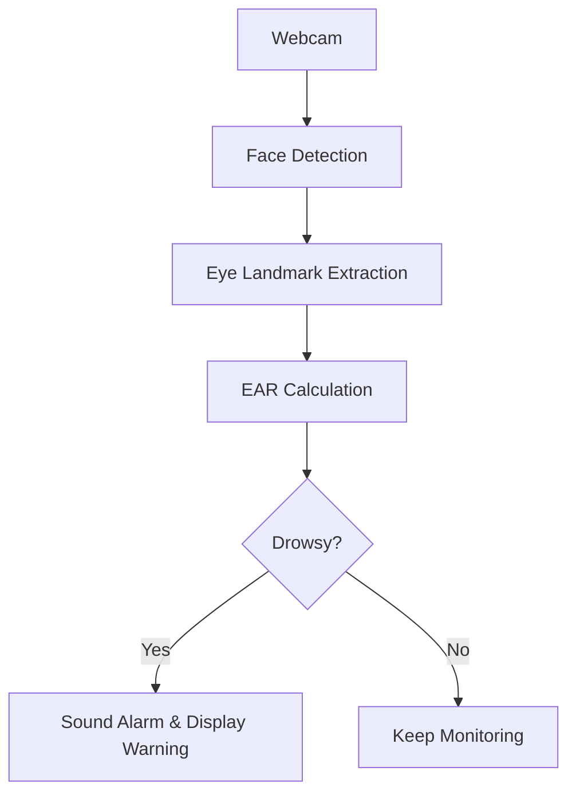

# 🚗😴 Driver Drowsiness Detection System 😴🚗

<div align="center">
  
  <h2>Don't snooze and cruise! Stay alert with AI-powered Drowsiness Detection 🚨</h2>
</div>

---

## ✨ Overview

**Driver Drowsiness Detection System** is a real-time, AI-powered solution built in Python to prevent accidents caused by sleepy drivers. By leveraging computer vision and deep learning, it monitors driver alertness and sends warnings when signs of drowsiness are detected.

---

## 🧠 How It Works

1. **Face & Eye Detection:** Uses OpenCV and pre-trained models to identify the driver's face and eyes in live video.
2. **Drowsiness Analysis:** Calculates Eye Aspect Ratio (EAR) to detect slow blinks or closed eyes.
3. **Real-Time Alerts:** Triggers buzzer sounds and on-screen warnings if drowsiness is detected.
4. **Safety First:** Designed for ease of use in vehicles, using only a webcam and your Python environment.

---

## 🚀 Features

- **Real-Time Video Processing** 🎥
- **Sound Alerts** 🔊
- **On-Screen Warnings** ⚠️
- **Simple Setup** 🔧
- **Fully in Python!** 🐍

---

## 🛠️ Installation

```bash
git clone https://github.com/PriyankaAsthana/Driver-Drowsiness-Detection-System.git
cd Driver-Drowsiness-Detection-System
pip install -r requirements.txt
python main.py
```

**Requirements:**
- Python 3.x
- OpenCV
- dlib
- imutils
- scipy
- numpy

---

## 👀 How to Use

1. Connect a webcam to your system.
2. Run the application:
    ```bash
    python main.py
    ```
3. The system will start monitoring your eyes.
4. If drowsiness is detected, you'll hear a buzzer and see an on-screen warning. Stay alert!

---

## 💡 How It Detects Drowsiness

- **EAR (Eye Aspect Ratio):**  
  Measures the ratio of distances between key eye landmarks. If EAR drops below a threshold for a set number of frames, the driver is likely drowsy.

  <div align="center">
    
  </div>

---

## 🖼️ System Architecture



---

## 🤖 Powered By

- [OpenCV](https://opencv.org/)
- [dlib](http://dlib.net/)
- [imutils](https://github.com/jrosebr1/imutils)
- [scipy](https://www.scipy.org/)
- [Python](https://www.python.org/)

---

## 🌟 Contributing

Pull requests are welcome! For major changes, please open an issue first to discuss what you would like to change.

---

## ⚠️ Disclaimer

This project is for educational purposes. Do not rely solely on this system for driver safety. Always stay alert and drive responsibly.

---

<div align="center">
  
  <h2>Don't let drowsiness steer your journey!</h2>
</div>

---
